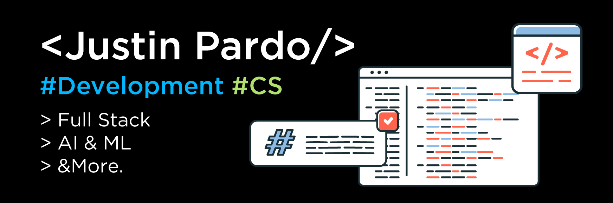

# 🌱 Justin Pardo 

**`(Aspiring Software Developer)`**

As a computer science student with a passion for technology, I've built each of the showcased projects from the ground up, employing my own problem-solving skills. Each project includes a README file describing the purpose of the code, the technologies I used, and what I learned along the way, along with a demo. The best thing about coding is turning an idea into a plan and eventually into a working product.

---

## 🚀 Skills

### Languages

  
 
  
  
  
  

### Frontend Frameworks & ORM

  
  
  
  
  

### Databases & API

  
  
  
  

### Other Skills

  
  
  
  

## 📈 GitHub Stats

